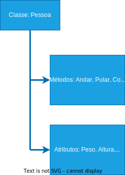
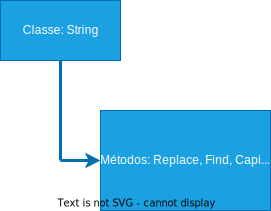
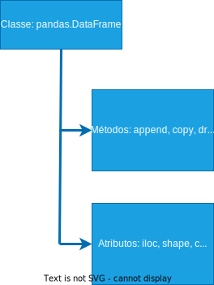

<!-- @import "style.html" -->

# Orientação a Objetos Completo - Classes e Métodos

* Tudo no Python é um Objeto;
* Objetos, na verdade, são Classes em Python;
* Cada Classe tem Métodos e Atributos.

### Classes

__Classes__ são Objetos e __Métodos__ é o que aquele Objeto consegue fazer. Já os __Atributos__, refere-se a quais são as informações/propriedades desse Objeto.

#### Exemplos

Classe __Classe__:

    

Classe __Pessoa__:

    

Classe __TV__:

    

Classe __String__:

    

Classe __Pandas__:

    

Cada __Objeto__ é um __Tipo__. Dizemos: *_“É um objeto do Tipo String, é um objeto do tipo Int, é um Objeto do Tipo DataFrame...”_*

<!--
