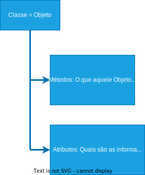
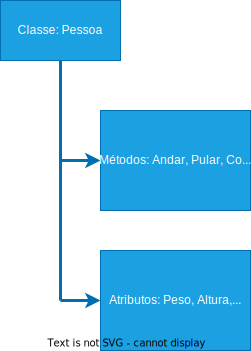
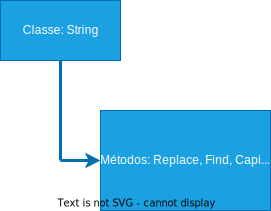
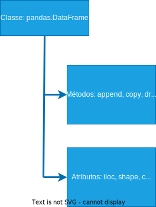
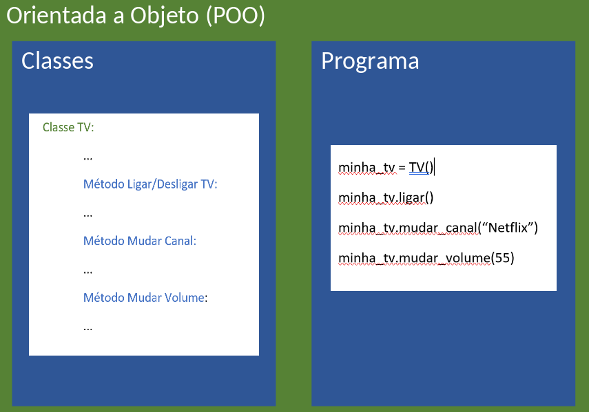
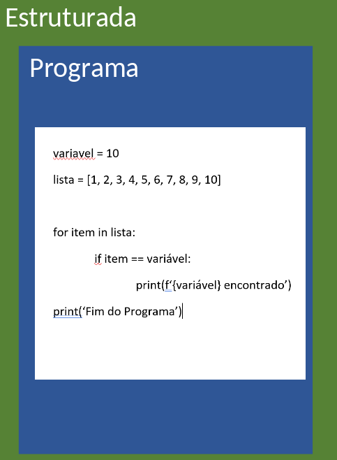

<!-- @import "style.html" -->

# Orientação a Objetos Completo - Classes e Métodos

* Tudo no Python é um Objeto;
* Objetos, na verdade, são Classes em Python;
* Cada Classe tem Métodos e Atributos.

### Classes

__Classes__ são Objetos e __Métodos__ é o que aquele Objeto consegue fazer. Já os __Atributos__, refere-se a quais são as informações/propriedades desse Objeto.

Em Python, dividimos os métodos, em 2 grupos: __Métodos de instância__
e __Métodos de Classe__.

__Métodos de instância__ é o método dunder __init__,  \___init_\__ é um método especial chamado de construtor e sua função é construir o objeto a partir da classe. Todo elemento em Python que inicia e finaliza com duplo underline é chamado de dunder (Double Underline). Os métodos/funções dunder em Python são chamados de métodos mágicos. Criamos métodos de instância, quando os métodos precisam fazer acesso a atributos.
__ATENÇÃO!__ Por mais que possamos criar nossas próprias funções utilizando dunder (underline no início e no fim) não é aconselhado. Python possui vários métodos com esta forma de nomenclatura e pode ser que mudemos o comportamento dessas funções mágicas internas da linguagem. Então, evite ao máximo. De preferência nunca o faça. Métodos são escritos em letras minúsculas. Se o nome for composto, o nome terá as palavras separadas por underline.

```python
from passlib.hash import pbkdf2_sha256 as cryp

class Usuario:
		def __init__(self, nome, sobrenome, email, senha):
        self.__id = Usuario.contador + 1
        self.__nome = nome
        self.__sobrenome = sobrenome
        self.__email = email
        self.__senha = cryp.hash(senha, rounds=200000, salt_size=16)
        Usuario.contador = self.__id
        print(f'Usuário criado: {self.__gera_usuario()}')

    def nome_completo(self):
        return f'{self.__nome} {self.__sobrenome}'

    def checa_senha(self, senha):
        if cryp.verify(senha, self.__senha):
            return True
        return False

nome = input('Informe o nome: ')
sobrenome = input('Informe o sobrenome: ')
email = input('Informe o e-mail: ')
senha = input('Informe a senha: ')
confirma_senha = input('Confirme a senha: ')

if senha == confirma_senha:
    user = Usuario(nome, sobrenome, email, senha)
else:
    print('Senha não confere...')
    exit(1)

print('Usuário criado com sucesso!')

senha = input('Informe a senha para acesso: ')

if user.checa_senha(senha):
    print('Acesso permitido')
else:
    print('Acesso negado')

print(f'Senha User Criptografada: {user._Usuario__senha}')  # Acesso errado
```
__Métodos de Classe__ em Python são conhecidos como Métodos Estáticos em outras linguagens.

```python
from passlib.hash import pbkdf2_sha256 as cryp


class Usuario:

    contador = 0

    @classmethod
    def conta_usuarios(cls):
        print(f'Classe: {cls}')
        print(f'Temos {cls.contador} usuário(s) no sistema')

    @classmethod
    def ver(cls):
        print('Teste')

    @staticmethod
    def definicao():
        return 'UXR344'

    def __init__(self, nome, sobrenome, email, senha):
        self.__id = Usuario.contador + 1
        self.__nome = nome
        self.__sobrenome = sobrenome
        self.__email = email
        self.__senha = cryp.hash(senha, rounds=200000, salt_size=16)
        Usuario.contador = self.__id
        print(f'Usuário criado: {self.__gera_usuario()}')

    def nome_completo(self):
        return f'{self.__nome} {self.__sobrenome}'

    def checa_senha(self, senha):
        if cryp.verify(senha, self.__senha):
            return True
        return False

		# Método privado
    def __gera_usuario(self):
        return self.__email.split('@')[0]


print(user._Usuario__gera_usuario)

# Método Estático


print(Usuario.contador) # Forma correta

print(Usuario.definicao())

user = Usuario('Felicity', 'Jones', 'felicity@gmail.com', '123456')

user.conta_usuarios()  # Possível, mas incorreta

print(user.contador)

print(user.definicao())
```

Já os atributos são divididos em __Atributos de Instância__, __Atributos de Classe__ e __Atributos de Dinâmicos__ e esses atributos podem ser __Público__ ou __Privado__. Isso significa que estamos falando da acessibilidade dos Atributos, ou seja, em um __Atributo Privado__, só é possível fazer acesso dentro da própria Classe onde foi declarado. Já __Atributo Público__, é possível acessar em qualquer parte do programa, até mesmo em outras Classes.

__Atributo Público__

```python
# Classes com Atributo de Instância Público


class Lampada:

    def __init__(self, voltagem, cor):
        self.voltagem = voltagem
        self.cor = cor
        self.ligada = False


class ContaCorrente:

    def __init__(self, numero, limite, saldo):
        self.numero = numero
        self.limite = limite
        self.saldo = saldo


class Produto:

    def __init__(self, nome, descricao, valor):
        self.nome = nome
        self.descricao = descricao
        self.valor = valor


class Usuario:

    def __init__(self, nome, email, senha):
        self.nome = nome
        self.email = email
        self.senha = senha

"""
O parâmetro self é o próprio objeto.
Logo o objeto Usuario no atributo nome recebe nome.
"""
```
__Atributo Privado__

```python
# Classes com Atributo de Instância Privado

class Acesso:

    def __init__(self, email, senha):
        self.email = email
        self.__senha = senha

    def mostra_senha(self):
        print(self.__senha)

    def mostra_email(self):
        print(self.email)

# Exemplo

user = Acesso('user@gmail.com', '123456')

print(user.email)

# print(user.__senha)  # AttributeError

print(user._Acesso__senha)  # Temos acesso. Mas não deveríamos fazer este acesso. (Name Mangling)

user.mostra_senha()

user.mostra_email()

user1 = Acesso('user1@gmail.com', '123456')
user2 = Acesso('user2@gmail.com', '654321')

user1.mostra_email()
user2.mostra_email()

# Atributos de instância, ou seja,cada instância tem o seu próprio valor.
p1 = Produto('PlayStation 4', 'Video Game', 2300)
p2 = Produto('Xbox S', 'Video Game', 4500)
```

* __Atributos de Instância__ são atributos declarados dentro do método construtor (método _init_, que é um método especial utilizado para a construção do objeto), ou seja, significa que em uma Classe os Atributos podem ter valores diferentes para cada um dos atributos.

```python
class Usuario:

    def __init__(self, nome, email, senha):
        self.nome = nome
        self.email = email
        self.senha = senha
```

* __Atributos de Classe__ são atributos, claro, que são declarados diretamente na classe, ou seja, fora do construtor (método _init_). Geralmente já inicializamos um valor, e este valor é compartilhado entre todas as instâncias da classe. Ou seja, ao invés de cada instância da classe ter seus próprios valores como é o caso dos atributos de instância, com os atributos de classe todas as instâncias terão o mesmo valor para este atributo.

```python
class Produto:

    # Atributo de classe
    imposto = 1.05  # 0.05% de imposto
    contador = 0

    def __init__(self, nome, descricao, valor):
        self.id = Produto.contador + 1
        self.nome = nome
        self.descricao = descricao
        self.valor = (valor * Produto.imposto)
        Produto.contador = self.id

p1 = Produto('PlayStation 4', 'Video Game', 2300)
p2 = Produto('Xbox S', 'Video Game', 4500)

print(p1.id)
print(p2.id)

# O Valor do atributo é o mesmo para as duas instâncias.
print(p1.imposto)
print(p12.imposto)

print(p1.valor)  # Acesso possível, mas incorreto de um atributo de classe
print(p2.valor)  # Acesso possível, mas incorreto de um atributo de classe
print(Produto.imposto)  # Acesso correto de um atributo de classe
```

__Atributos de Dinâmicos__ é um atributo de instância que pode ser criado em tempo de execução. Porém, o atributo dinâmico será exclusivo da instância que o criou.

```python
class Produto:

    # Atributo de classe
    imposto = 1.05  # 0.05% de imposto
    contador = 0

    def __init__(self, nome, descricao, valor):
        self.id = Produto.contador + 1
        self.nome = nome
        self.descricao = descricao
        self.valor = (valor * Produto.imposto)
        Produto.contador = self.id

p1 = Produto('PlayStation 4', 'Video Game', 2300)

p2 = Produto('Arroz', 'Mercearia', 5.99)

# Criando um atributo dinâmico em tempo de execução

p2.peso = '5kg'  # Note que na classe Produto não existe o atributo peso

print(f'Produto: {p2.nome}, Descrição: {p2.descricao}, Valor: {p2.valor}, Peso: {p2.peso}')
# print(f'Produto: {p1.nome}, Descrição: {p1.descricao}, Valor: {p1.valor}, Peso: {p1.peso}')

# Deletando atributos

print(p1.__dict__)
print(p2.__dict__)

# print(Produto.__dict__)

del p2.peso
del p2.valor
del p2.descricao

print(p1.__dict__)
print(p2.__dict__)
```

#### Exemplos

Classe __Objeto__:

<p align="center">
    
</p>

Classe __Pessoa__:

<p align="center">
    
</p>

Classe __TV__:

<p align="center">
    
</p>

Classe __String__:

<p align="center">
    
</p>

Classe __Pandas__:

<p align="center">
    
</p>

Cada __Objeto__ é um __Tipo__. Dizemos: *_“É um objeto do Tipo String, é um objeto do tipo Int, é um Objeto do Tipo DataFrame...”_*

### Programação Orientada a Objeto X Programação Estruturada

#### Programação Orientada a Objeto

<p align="center">
    
</p>

#### Programação Estruturada

<p align="center">
    
</p>

#### Qual a vantagem da Orientação a Objeto?

  * Aproveitar o código sem precisar refazer/copiar tudo;
  * __Encapsulamento__ -> Proteção a mudanças indesejadas (ex: TV – você não pode desligar a tv no botão de mudar o volume);
  * __Herança__ -> Instâncias do Objeto tem as mesmas características, apesar de ter valores diferentes;
  * __Polimorfismo__ -> Um mesmo método pode ter várias “formas” em diferentes classes (ou subclasses) – ex: Animais -> Gatos x Cachorros.

### Abstração e Encapsulamento

O grande objetivo da POO é encapsular nosso código dentro de um grupo lógico e hierárquico utilizando Classes. Imagine que temos uma Classe chamada __Pessoa__, contendo
um atributo privado chamado __\_nome_ e um método privado chamado __\_falar()_. Esses elementos privados só devem/deveriam ser acessados dentro da Classe. Mas Python não bloqueia este acesso
fora da Classe. Com Python acontece um fenômeno chamado __Name Mangling__, que faz uma alteração na forma de se acessar os elementos privados, conforme: _Classe__elemento, por exemplo, acessando elementos privados fora da classe: instancia._Pessoa__nome e instancia._Pessoa__falar(). Abstração, em POO, é o ato de expor apenas dados relevantes de uma classe, escondendo atributos e métodos privados de usuário.

#### Exemplo

```python
class Conta:

    contador = 400

    def __init__(self, titular, saldo, limite):
        self.numero = Conta.contador
        self.titular = titular
        self.saldo = saldo
        self.limite = limite
        Conta.contador += 1

    def extrato(self):
        print(f'Saldo de {self.saldo} do titular {self.titular} com limite de {self.limite}')

    def depositar(self, valor):
        if valor > 0:
            self.saldo += valor
        else:
            print('O valor precisa ser positivo')

    def sacar(self, valor):
        if valor > 0:
            if self.saldo >= valor:
                self.saldo -= valor
            else:
                print('Saldo insuficiente')
        else:
            print('O valor deve ser positivo')

    def transferir(self, valor, conta_destino):
        # 1 - Remover o valor da conta de origem
        self.saldo -= valor
        self.saldo -= 10  # Taxa de transferência paga por quem realizou a transferência

        # 2 - Adicionar o valor na conta de destibo
        conta_destino.saldo += valor

conta1 = Conta('Angelina', 150.00, 1500)
conta1.nome = 'Portela'
conta1.saldo = 34433333334444
```

```python
class Conta:

    contador = 400

    def __init__(self, titular, saldo, limite):
        self.__numero = Conta.contador
        self.__titular = titular
        self.__saldo = saldo
        self.__limite = limite
        Conta.contador += 1

    def extrato(self):
        print(f'Saldo de {self.__saldo} do titular {self.__titular} com limite de {self.__limite}')

    def depositar(self, valor):
        if valor > 0:
            self.__saldo += valor
        else:
            print('O valor precisa ser positivo')

    def sacar(self, valor):
        if valor > 0:
            if self.__saldo >= valor:
                self.__saldo -= valor
            else:
                print('Saldo insuficiente')
        else:
            print('O valor deve ser positivo')

    def transferir(self, valor, conta_destino):
        # 1 - Remover o valor da conta de origem
        self.__saldo -= valor
        self.__saldo -= 10  # Taxa de transferência paga por quem realizou a transferência

        # 2 - Adicionar o valor na conta de destibo
        conta_destino.__saldo += valor

print(conta1.__dict__)

conta1.extrato()

print(conta1._Conta__titular)  # Name Mangling

conta1._Conta__titular = 'Angelina'

print(conta1.__dict__)

print(conta1.__dict__)

conta1.depositar(150)

print(conta1.__dict__)

conta1.sacar(200)

print(conta1.__dict__)


# Testando

conta1 = Conta('Angelina', 150.00, 1500)
conta1.extrato()

conta2 = Conta('Felicity', 300, 2000)
conta2.extrato()

conta2.transferir(100, conta1)

conta1.extrato()
conta2.extrato()
```
<!--
