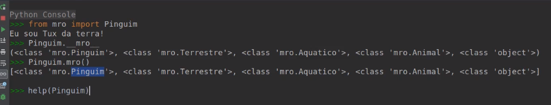

<!-- @import "style.html" -->

# Orientação a Objetos Completo - Classes e Métodos

* Tudo no Python é um Objeto;
* Objetos, na verdade, são Classes em Python;
* Cada Classe tem Métodos e Atributos.

### Classes

__Classes__ são Objetos e __Métodos__ é o que aquele Objeto consegue fazer. Já os __Atributos__, refere-se a quais são as informações/propriedades desse Objeto.

##### Exemplos - Classes

Classe __Objeto__:

<p align="center">
    
</p>

Classe __Pessoa__:

<p align="center">
    
</p>

Classe __TV__:

<p align="center">
    
</p>

Classe __String__:

<p align="center">
    
</p>

Classe __Pandas__:

<p align="center">
    
</p>

Cada __Objeto__ é um __Tipo__. Dizemos: *_“É um objeto do Tipo String, é um objeto do tipo Int, é um Objeto do Tipo DataFrame...”_*

Em Python, dividimos os __Métodos__, em 2 grupos: __Métodos de instância__
e __Métodos de Classe__.

__Métodos de instância__ é o método dunder __init__,  \___init_\__ é um método especial chamado de construtor e sua função é construir o objeto a partir da classe. Todo elemento em Python que inicia e finaliza com duplo underline é chamado de dunder (Double Underline). Os métodos/funções dunder em Python são chamados de métodos mágicos. Criamos métodos de instância, quando os métodos precisam fazer acesso a atributos.
__ATENÇÃO!__ Por mais que possamos criar nossas próprias funções utilizando dunder (underline no início e no fim) não é aconselhado. Python possui vários métodos com esta forma de nomenclatura e pode ser que mudemos o comportamento dessas funções mágicas internas da linguagem. Então, evite ao máximo. De preferência nunca o faça. Métodos são escritos em letras minúsculas. Se o nome for composto, o nome terá as palavras separadas por underline.

```python
from passlib.hash import pbkdf2_sha256 as cryp

class Usuario:
		def __init__(self, nome, sobrenome, email, senha):
        self.__id = Usuario.contador + 1
        self.__nome = nome
        self.__sobrenome = sobrenome
        self.__email = email
        self.__senha = cryp.hash(senha, rounds=200000, salt_size=16)
        Usuario.contador = self.__id
        print(f'Usuário criado: {self.__gera_usuario()}')

    def nome_completo(self):
        return f'{self.__nome} {self.__sobrenome}'

    def checa_senha(self, senha):
        if cryp.verify(senha, self.__senha):
            return True
        return False

nome = input('Informe o nome: ')
sobrenome = input('Informe o sobrenome: ')
email = input('Informe o e-mail: ')
senha = input('Informe a senha: ')
confirma_senha = input('Confirme a senha: ')

if senha == confirma_senha:
    user = Usuario(nome, sobrenome, email, senha)
else:
    print('Senha não confere...')
    exit(1)

print('Usuário criado com sucesso!')

senha = input('Informe a senha para acesso: ')

if user.checa_senha(senha):
    print('Acesso permitido')
else:
    print('Acesso negado')

print(f'Senha User Criptografada: {user._Usuario__senha}')  # Acesso errado
```
__Métodos de Classe__ em Python são conhecidos como Métodos Estáticos em outras linguagens.

```python
from passlib.hash import pbkdf2_sha256 as cryp


class Usuario:

    contador = 0

    @classmethod
    def conta_usuarios(cls):
        print(f'Classe: {cls}')
        print(f'Temos {cls.contador} usuário(s) no sistema')

    @classmethod
    def ver(cls):
        print('Teste')

    @staticmethod
    def definicao():
        return 'UXR344'

    def __init__(self, nome, sobrenome, email, senha):
        self.__id = Usuario.contador + 1
        self.__nome = nome
        self.__sobrenome = sobrenome
        self.__email = email
        self.__senha = cryp.hash(senha, rounds=200000, salt_size=16)
        Usuario.contador = self.__id
        print(f'Usuário criado: {self.__gera_usuario()}')

    def nome_completo(self):
        return f'{self.__nome} {self.__sobrenome}'

    def checa_senha(self, senha):
        if cryp.verify(senha, self.__senha):
            return True
        return False

		# Método privado
    def __gera_usuario(self):
        return self.__email.split('@')[0]


print(user._Usuario__gera_usuario)

# Método Estático


print(Usuario.contador) # Forma correta

print(Usuario.definicao())

user = Usuario('Felicity', 'Jones', 'felicity@gmail.com', '123456')

user.conta_usuarios()  # Possível, mas incorreta

print(user.contador)

print(user.definicao())
```

Já os atributos são divididos em __Atributos de Instância__, __Atributos de Classe__ e __Atributos Dinâmicos__ e esses atributos podem ser __Público__ ou __Privado__. Isso significa que estamos falando da acessibilidade dos Atributos, ou seja, em um __Atributo Privado__, só é possível fazer acesso dentro da própria Classe onde foi declarado. Já __Atributo Público__, é possível acessar em qualquer parte do programa, até mesmo em outras Classes.

__Atributo Público__

```python
# Classes com Atributo de Instância Público


class Lampada:

    def __init__(self, voltagem, cor):
        self.voltagem = voltagem
        self.cor = cor
        self.ligada = False


class ContaCorrente:

    def __init__(self, numero, limite, saldo):
        self.numero = numero
        self.limite = limite
        self.saldo = saldo


class Produto:

    def __init__(self, nome, descricao, valor):
        self.nome = nome
        self.descricao = descricao
        self.valor = valor


class Usuario:

    def __init__(self, nome, email, senha):
        self.nome = nome
        self.email = email
        self.senha = senha

"""
O parâmetro self é o próprio objeto.
Logo o objeto Usuario no atributo nome recebe nome.
"""
```
__Atributo Privado__

```python
# Classes com Atributo de Instância Privado

class Acesso:

    def __init__(self, email, senha):
        self.email = email
        self.__senha = senha

    def mostra_senha(self):
        print(self.__senha)

    def mostra_email(self):
        print(self.email)

# Exemplo

user = Acesso('user@gmail.com', '123456')

print(user.email)

# print(user.__senha)  # AttributeError

print(user._Acesso__senha)  # Temos acesso. Mas não deveríamos fazer este acesso. (Name Mangling)

user.mostra_senha()

user.mostra_email()

user1 = Acesso('user1@gmail.com', '123456')
user2 = Acesso('user2@gmail.com', '654321')

user1.mostra_email()
user2.mostra_email()

# Atributos de instância, ou seja,cada instância tem o seu próprio valor.
p1 = Produto('PlayStation 4', 'Video Game', 2300)
p2 = Produto('Xbox S', 'Video Game', 4500)
```

* __Atributos de Instância__ são atributos declarados dentro do método construtor (método _init_, que é um método especial utilizado para a construção do objeto), ou seja, significa que em uma Classe os Atributos podem ter valores diferentes para cada um dos atributos.

```python
class Usuario:

    def __init__(self, nome, email, senha):
        self.nome = nome
        self.email = email
        self.senha = senha
```

* __Atributos de Classe__ são atributos, claro, que são declarados diretamente na classe, ou seja, fora do construtor (método _init_). Geralmente já inicializamos um valor, e este valor é compartilhado entre todas as instâncias da classe. Ou seja, ao invés de cada instância da classe ter seus próprios valores como é o caso dos atributos de instância, com os atributos de classe todas as instâncias terão o mesmo valor para este atributo.

```python
class Produto:

    # Atributo de classe
    imposto = 1.05  # 0.05% de imposto
    contador = 0

    def __init__(self, nome, descricao, valor):
        self.id = Produto.contador + 1
        self.nome = nome
        self.descricao = descricao
        self.valor = (valor * Produto.imposto)
        Produto.contador = self.id

p1 = Produto('PlayStation 4', 'Video Game', 2300)
p2 = Produto('Xbox S', 'Video Game', 4500)

print(p1.id)
print(p2.id)

# O Valor do atributo é o mesmo para as duas instâncias.
print(p1.imposto)
print(p12.imposto)

print(p1.valor)  # Acesso possível, mas incorreto de um atributo de classe
print(p2.valor)  # Acesso possível, mas incorreto de um atributo de classe
print(Produto.imposto)  # Acesso correto de um atributo de classe
```

__Atributos Dinâmicos__ é um atributo de instância que pode ser criado em tempo de execução. Porém, o atributo dinâmico será exclusivo da instância que o criou.

```python
class Produto:

    # Atributo de classe
    imposto = 1.05  # 0.05% de imposto
    contador = 0

    def __init__(self, nome, descricao, valor):
        self.id = Produto.contador + 1
        self.nome = nome
        self.descricao = descricao
        self.valor = (valor * Produto.imposto)
        Produto.contador = self.id

p1 = Produto('PlayStation 4', 'Video Game', 2300)

p2 = Produto('Arroz', 'Mercearia', 5.99)

# Criando um atributo dinâmico em tempo de execução

p2.peso = '5kg'  # Note que na classe Produto não existe o atributo peso

print(f'Produto: {p2.nome}, Descrição: {p2.descricao}, Valor: {p2.valor}, Peso: {p2.peso}')
# print(f'Produto: {p1.nome}, Descrição: {p1.descricao}, Valor: {p1.valor}, Peso: {p1.peso}')

# Deletando atributos

print(p1.__dict__)
print(p2.__dict__)

# print(Produto.__dict__)

del p2.peso
del p2.valor
del p2.descricao

print(p1.__dict__)
print(p2.__dict__)
```
### Programação Orientada a Objeto X Programação Estruturada

#### Programação Orientada a Objeto

<p align="center">
    
</p>

#### Programação Estruturada

<p align="center">
    
</p>

#### Qual a vantagem da Orientação a Objeto?

  * Aproveitar o código sem precisar refazer/copiar tudo;
  * __Encapsulamento__ -> Proteção a mudanças indesejadas (ex: TV – você não pode desligar a tv no botão de mudar o volume);
  * __Herança__ -> Instâncias do Objeto tem as mesmas características, apesar de ter valores diferentes;
  * __Polimorfismo__ -> Um mesmo método pode ter várias “formas” em diferentes classes (ou subclasses) – ex: Animais -> Gatos x Cachorros.

### Abstração e Encapsulamento

O grande objetivo da POO é encapsular nosso código dentro de um grupo lógico e hierárquico utilizando Classes. Imagine que temos uma Classe chamada __Pessoa__, contendo
um atributo privado chamado __\_nome_ e um método privado chamado __\_falar()_. Esses elementos privados só devem/deveriam ser acessados dentro da Classe. Mas Python não bloqueia este acesso
fora da Classe. Com Python acontece um fenômeno chamado __Name Mangling__, que faz uma alteração na forma de se acessar os elementos privados, conforme: _Classe__elemento, por exemplo, acessando elementos privados fora da classe: instancia._Pessoa__nome e instancia._Pessoa__falar(). Abstração, em POO, é o ato de expor apenas dados relevantes de uma classe, escondendo atributos e métodos privados de usuário.

#### Exemplo

```python
class Conta:

    contador = 400

    def __init__(self, titular, saldo, limite):
        self.numero = Conta.contador
        self.titular = titular
        self.saldo = saldo
        self.limite = limite
        Conta.contador += 1

    def extrato(self):
        print(f'Saldo de {self.saldo} do titular {self.titular} com limite de {self.limite}')

    def depositar(self, valor):
        if valor > 0:
            self.saldo += valor
        else:
            print('O valor precisa ser positivo')

    def sacar(self, valor):
        if valor > 0:
            if self.saldo >= valor:
                self.saldo -= valor
            else:
                print('Saldo insuficiente')
        else:
            print('O valor deve ser positivo')

    def transferir(self, valor, conta_destino):
        # 1 - Remover o valor da conta de origem
        self.saldo -= valor
        self.saldo -= 10  # Taxa de transferência paga por quem realizou a transferência

        # 2 - Adicionar o valor na conta de destibo
        conta_destino.saldo += valor

conta1 = Conta('Angelina', 150.00, 1500)
conta1.nome = 'Portela'
conta1.saldo = 34433333334444
```

```python
class Conta:

    contador = 400

    def __init__(self, titular, saldo, limite):
        self.__numero = Conta.contador
        self.__titular = titular
        self.__saldo = saldo
        self.__limite = limite
        Conta.contador += 1

    def extrato(self):
        print(f'Saldo de {self.__saldo} do titular {self.__titular} com limite de {self.__limite}')

    def depositar(self, valor):
        if valor > 0:
            self.__saldo += valor
        else:
            print('O valor precisa ser positivo')

    def sacar(self, valor):
        if valor > 0:
            if self.__saldo >= valor:
                self.__saldo -= valor
            else:
                print('Saldo insuficiente')
        else:
            print('O valor deve ser positivo')

    def transferir(self, valor, conta_destino):
        # 1 - Remover o valor da conta de origem
        self.__saldo -= valor
        self.__saldo -= 10  # Taxa de transferência paga por quem realizou a transferência

        # 2 - Adicionar o valor na conta de destibo
        conta_destino.__saldo += valor

print(conta1.__dict__)

conta1.extrato()

print(conta1._Conta__titular)  # Name Mangling

conta1._Conta__titular = 'Angelina'

print(conta1.__dict__)

print(conta1.__dict__)

conta1.depositar(150)

print(conta1.__dict__)

conta1.sacar(200)

print(conta1.__dict__)


# Testando

conta1 = Conta('Angelina', 150.00, 1500)
conta1.extrato()

conta2 = Conta('Felicity', 300, 2000)
conta2.extrato()

conta2.transferir(100, conta1)

conta1.extrato()
conta2.extrato()
```
# Herança e Polimorfismo

### **Herança (Inheritance):**

A ideia de herança é a de reaproveitar código. Também extender nossas classes.

**OBS:** Com a herança, a partir de uma classe existente, nós extendemos outra classe
que passa a herdar atributos e métodos da classe herdada.

**Cliente:**
- nome;
- sobrenome;
- cpf;
- renda;

**Funcionário:**
- nome;
- sobrenome;
- cpf;
- matricula;

**Perguntar:** Existe alguma entidade genérica o suciente para encapsular os atributos
e métodos comuns a outras entidades?

```python
class Cliente:

    def __init__(self, nome, sobrenome, cpf, renda):
        self.__nome = nome
        self.__sobrenome = sobrenome
        self.__cpf = cpf
        self.__renda = renda

    def nome_completo(self):
        return f'{self.__nome} {self.__sobrenome}'

class Funcionario:

    def __init__(self, nome, sobrenome, cpf, matricula):
        self.__nome = nome
        self.__sobrenome = sobrenome
        self.__cpf = cpf
        self.__matricula = matricula

    def nome_completo(self):
        return f'{self.__nome} {self.__sobrenome}'

cliente1 = Cliente('Angelina', 'Jolie', '123.456.789-00', 5000)
funcionario1 = Funcionario('Felicity', 'Jones', '987.654.321-11', 1234)

print(cliente1.nome_completo())
print(funcionario1.nome_completo())
```

**OBS:** Quando uma classe herda de outra classe ela herda **TODOS** os atributos e métodos da classe herdada.

Quando uma classe herda de outra classe, a classe herdada é conhecida por:
[Pessoa]
- Super Classe;
- Classe Mãe;
- Classe Pai;
- Classe Base;
- Classe Genérica;

Quando uma classe herda de outra classe, ela é chamada:
[Cliente, Funcionario]
- Sub Classe;
- Classe Filha;
- Classe Específica;

```python
class Pessoa:

    def __init__(self, nome, sobrenome, cpf):
        self.__nome = nome
        self.__sobrenome = sobrenome
        self.__cpf = cpf

    def nome_completo(self):
        return f'{self.__nome} {self.__sobrenome}'

class Cliente(Pessoa):
    """Cliente herda de Pessoa"""

    def __init__(self, nome, sobrenome, cpf, renda):
        Pessoa.__init__(self, nome, sobrenome, cpf)  # Forma não comum de acessar dados da super classe
        self.__renda = renda

class Funcionario(Pessoa):
    """Funcionario herda de Pessoa"""

    def __init__(self, nome, sobrenome, cpf, matricula):
        super().__init__(nome, sobrenome, cpf)  # Forma comum de acessar dados da super classe
        self.__matricula = matricula

cliente1 = Cliente('Angelina', 'Jolie', '123.456.789-00', 5000)
funcionario1 = Funcionario('Felicity', 'Jones', '987.654.321-11', 1234)

print(cliente1.nome_completo())
print(funcionario1.nome_completo())

print(cliente1.__dict__)

print(funcionario1.__dict__)
```

### **Sobrescrita de Métodos (Overriding):**

Sobrescrita de método, ocorre quando reescrevemos/reimplementamos um método presente na super classe em classes filhas.

```python
class Pessoa:

    def __init__(self, nome, sobrenome, cpf):
        self.__nome = nome
        self.__sobrenome = sobrenome
        self.__cpf = cpf

    def nome_completo(self):
        return f'{self.__nome} {self.__sobrenome}'

class Cliente(Pessoa):
    """Cliente herda de Pessoa"""

    def __init__(self, nome, sobrenome, cpf, renda):
        Pessoa.__init__(self, nome, sobrenome, cpf)  # Forma não comum de acessar dados da super classe
        self.__renda = renda

class Funcionario(Pessoa):
    """Funcionario herda de Pessoa"""

    def __init__(self, nome, sobrenome, cpf, matricula):
        super().__init__(nome, sobrenome, cpf)  # Forma comum de acessar dados da super classe
        self.__matricula = matricula

    def nome_completo(self):
        print(super().nome_completo())
        print(self._Pessoa__cpf)
        return f'Funcionário: {self.__matricula} Nome: {self._Pessoa__nome}'

cliente1 = Cliente('Angelina', 'Jolie', '123.456.789-00', 5000)
funcionario1 = Funcionario('Felicity', 'Jones', '987.654.321-11', 1234)

print(cliente1.nome_completo())
print(funcionario1.nome_completo())
```

### **Propriedades - Properties:**

Em linguagens de programação como o Java, ao declararmos atributos privados nas classes,
costumamos a criar métodos públicos para manipulação desses atributos. Esses métodos
são conhecidos por getters e setters, onde os getters retornam o valor do atributo
e os setters alteram o valor do mesmo.

```python
class Conta:

    contador = 0

    def __init__(self, titular, saldo, limite):
        self.__numero = Conta.contador + 1
        self.__titular = titular
        self.__saldo = saldo
        self.__limite = limite
        Conta.contador += 1

    def extrato(self):
        return f'Saldo de {self.__saldo} do cliente {self.__titular}'

    def depositar(self, valor):
        self.__saldo += valor

    def sacar(self, valor):
        self.__saldo -= valor

    def transferir(self, valor, destino):
        self.__saldo -= valor
        destino.__saldo += valor

    def get_numero(self):
        return self.__numero

    def get_titular(self):
        return self.__titular

    def set_titular(self, titular):
        self.__titular = titular

    def get_saldo(self):
        return self.__saldo

    def get_limite(self):
        return self.__limite

    def set_limite(self, limite):
        self.__limite = limite

conta1 = Conta('Felicity', 3000, 5000)
conta2 = Conta('Angelina', 2000, 4000)

print(conta1.extrato())
print(conta2.extrato())

soma = conta1.get_saldo() + conta2.get_saldo()
print(f'A soma do saldo das contas é {soma}')

print(conta1.__dict__)
conta1.set_limite(999999)
print(conta1.__dict__)
```

### **Getters e Setters:**

```python
class Conta:

    contador = 0

    def __init__(self, titular, saldo, limite):
        self.__numero = Conta.contador + 1
        self.__titular = titular
        self.__saldo = saldo
        self.__limite = limite
        Conta.contador += 1

		# getters
    @property
    def numero(self):
        return self.__numero

    @property
    def titular(self):
        return self.__titular

    @property
    def saldo(self):
        return self.__saldo

    @property
    def limite(self):
        return self.__limite

		# setters
    @limite.setter
    def limite(self, novo_limite):
        self.__limite = novo_limite

    def extrato(self):
        return f'Saldo de {self.__saldo} do cliente {self.__titular}'

    def depositar(self, valor):
        self.__saldo += valor

    def sacar(self, valor):
        self.__saldo -= valor

    def transferir(self, valor, destino):
        self.__saldo -= valor
        destino.__saldo += valor

    @property
    def valor_total(self):
        return self.__saldo + self.__limite

conta1 = Conta('Felicity', 3000, 5000)
conta2 = Conta('Angelina', 2000, 4000)

print(conta1.extrato())
print(conta2.extrato())

soma = conta1.saldo + conta2.saldo
print(f'A soma do saldo das contas é {soma}')

print(conta1.__dict__)
conta1.limite = 76543
print(conta1.__dict__)
print(conta1.limite)

print(conta1.valor_total)
print(conta2.valor_total)
```

### **O método super( ):**

O método super( ) se refere á super classe.

```python
class Animal:

    def __init__(self, nome, especie):
        self.__nome = nome
        self.__especie = especie

    def faz_som(self, som):
        print(f'O {self.__nome} fala {som}')

class Gato(Animal):

    def __init__(self, nome, especie, raca):
        # Animal.__init__(self, nome, especie)
        super().__init__(nome, especie)
        super().faz_som('auauauaua')
        self.__raca = raca

felix = Gato('Felix', 'Felino', 'Angorá')

felix.faz_som('miau')
```

Com o método super( ), é possível fazer acesso ao método construtor e também aos outros métodos.

### **Herança Múltipla:**

Herança Múltipla nada mais é do que a possibilidade de uma classe herdar de múltiplas classes,
fazendo com que a classe filha herde todos os atributos e métodos de todas as classes herdadas.

**OBS:** A herança múltipla pode ser feita de duas maneiras:
- Por Multiderivação Direta;
- Por Multiderivação Indireta;

### **Multiderivação Direta:**

```python
class Base1:
    pass

class Base2:
    pass

class Base3:
    pass

class MultiDerivada(Base1, Base2, Base3):
    pass
```

### **Multiderivação Indireta:**

```python
class Base1:
    pass

class Base2(Base1):
    pass

class Base3(Base2):
    pass

class MultiDerivada(Base3):
    pass
```

**OBS:** Não importa se a derivação é direta ou indireta. A classe que realizar a herança herdará
todos os atributos e métodos das super classes.

```python
class Animal:

    def __init__(self, nome):
        self.__nome = nome

    def cumprimentar(self):
        return f'Eu sou {self.__nome}'

class Aquatico(Animal):

    def __init__(self, nome):
        super().__init__(nome)

    def nadar(self):
        return f'{self._Animal__nome} está nadando.'

    def cumprimentar(self):
        return f'Eu sou {self._Animal__nome} do mar!'

class Terrestre(Animal):

    def __init__(self, nome):
        super().__init__(nome)

    def andar(self):
        return f'{self._Animal__nome} está andando.'

    def cumprimentar(self):
        return f'Eu sou {self._Animal__nome} da terra!'

class Pinguim(Aquatico, Terrestre):
		"Essa ordem na herança da classe Pinguim(Aquatico, Terrestre) influencia na
			na ordem de excução do método."

    def __init__(self, nome):
        super().__init__(nome)

# Testando

baleia = Aquatico('Wally')
print(baleia.nadar())
print(baleia.cumprimentar())

tatu = Terrestre('Xim')
print(tatu.andar())
print(tatu.cumprimentar())

tux = Pinguim('Tux')
print(tux.andar())
print(tux.nadar())
print(tux.cumprimentar())  # Eu sou Tux da terra! / Eu sou Tux do mar! ???? Method Resolution Order - MRO
```

A ordem da herança influencia na execução do método.

```python
# Objeto é instância de...

print(f'Tux é instância de Pinguim? {isinstance(tux, Pinguim)}')  # True
print(f'Tux é instância de Aquatico? {isinstance(tux, Aquatico)}')  # True
print(f'Tux é instância de Terrestre? {isinstance(tux, Terrestre)}')  # True
print(f'Tux é instância de Animal? {isinstance(tux, Animal)}')  # True
print(f'Tux é instância de object? {isinstance(tux, object)}')  # True
```

### **MRO - Method Resolution Order:**

Method Resolution Order (Resolução de Ordem de Métodos), é a ordem
de execução dos métodos (quem será executado primeiro).

Em Python, a gente pode conferir a ordem de execução dos métodos (MRO) de 3 formas:
- Via propriedade da classe **mro**
- Via método mro( )
- Via help

<p align="center">
    
</p>

Tenta executar o método na seguinte ordem:

Pinguim

Terrestre

Aquatico

Animais

object

```python
class Animal:

    def __init__(self, nome):
        self.__nome = nome

    def cumprimentar(self):
        return f'Eu sou {self.__nome}'

class Aquatico(Animal):

    def __init__(self, nome):
        super().__init__(nome)

    def nadar(self):
        return f'{self._Animal__nome} está nadando.'


class Terrestre(Animal):

    def __init__(self, nome):
        super().__init__(nome)

    def andar(self):
        return f'{self._Animal__nome} está andando.'

    def cumprimentar(self):
        return f'Eu sou {self._Animal__nome} da terra!'

class Pinguim(Aquatico, Terrestre):

    def __init__(self, nome):
        super().__init__(nome)

# Testando

tux = Pinguim('Tux')
print(tux.cumprimentar())

"""
Pinguim(Aquatico, Terrestre)
Eu sou Tux do mar!

Pinguim(Terrestre, Aquatico)
Eu sou Tux da terra!
"""
```

### **Polimorfismo:**

Poli -> Muitas
Morfis -> Formas

Quando a gente reimplementa um método presente na classe pai em classes filhas
estamos realizando uma sobrescrita de método (Overriding).

O overriding é a melhor representação do polimorfismo.

```python
class Animal(object):

    def __init__(self, nome):
        self.__nome = nome

    def falar(self):
        raise NotImplementedError('A classe filha precisa implementar este método')

    def comer(self):
        print(f'{self.__nome} está comendo...')

class Cachorro(Animal):

    def __init__(self, nome):
        super().__init__(nome)

    def falar(self):
        print(f'{self._Animal__nome} fala wau wau')

class Gato(Animal):

    def __init__(self, nome):
        super().__init__(nome)

    def falar(self):
        print(f'{self._Animal__nome} fala miau!')

class Rato(Animal):

    def __init__(self, nome):
        super().__init__(nome)

    def falar(self):
        print(f'{self._Animal__nome} fala algo...')

# Testes

felix = Gato('Felix')
felix.comer()
felix.falar()

pluto = Cachorro('Pluto')
pluto.comer()
pluto.falar()

mickey = Rato('Mickey')
mickey.comer()
mickey.falar()
```

### **Métodos Mágicos:**

Métodos Mágicos, são todos os métodos que utilizam dunder.

**dunder init -> __init__( ):**

```python
def __init__(self, titulo, autor, paginas):
    self.titulo = titulo
    self.autor = autor
    self.paginas = paginas
```

**Dunder > Double Underscore:**

dunder repr -> Representação do objeto

```python
def __repr__(self):
    return f'{self.titulo} escrito por {self.autor}'
```

```python
class Livro:

    def __init__(self, titulo, autor, paginas):
        self.titulo = titulo
        self.autor = autor
        self.paginas = paginas

    def __str__(self):
        return self.titulo

    def __repr__(self):
        return f'{self.titulo} escrito por {self.autor}'

    def __len__(self):
        return self.paginas

    def __del__(self):
        print('Um objeto do tipo Livro foi deletado da memória')

    def __add__(self, outro):
        return f'{self} - {outro}'

    def __mul__(self, outro):
        if isinstance(outro, int):
            msg = ''
            for n in range(outro):
                msg += ' ' + str(self)
            return msg
        return 'Não posso multiplicar'

livro1 = Livro('Python Rocks!', 'Geek University', 400)
livro2 = Livro('Inteligência Artificial com Python', 'Geek University', 350)

print(livro1)

print(livro2)

print(len(livro1))
print(len(livro2))

print(livro1 + livro2)

print(livro1 * 5)
```

<!--
